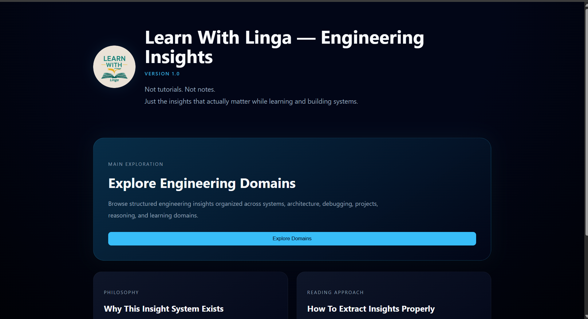

# Learn With Linga — Engineering Insights

**Version:** 1.1

> I learn. I understand. I extract the insight — so you don’t waste time.

---



---

## 📌 What is this?

**Learn With Linga — Engineering Insights** is a markdown-driven engineering insight platform built for:

* structured learning
* debugging-driven understanding
* system-level thinking
* insight extraction while building
* preserving engineering realizations
* documenting learning breakthroughs

This is not a tutorial platform.

This is not a note-taking repository.

This is:

> a structured engineering insight system

---

## 🧠 Core Idea

Most learners:

* consume content passively
* memorize concepts
* fail to connect ideas to real systems
* forget what they learn while building
* move through topics without extracting deeper understanding

This platform exists to:

* extract what actually matters
* preserve engineering understanding
* connect concepts to real-world systems
* document failures, fixes, and realizations
* preserve reusable engineering lessons
* capture insights that remain valuable across domains

The goal is not to document everything.

The goal is to preserve:

> the understanding behind the information.

---

## ⚙️ Platform Overview

The platform works through a markdown-first architecture.

---

### Frontend

Built using:

* React (Vite)
* React Router
* ReactMarkdown
* Responsive UI architecture
* Animated insight rendering

Responsibilities:

* domain exploration
* insight rendering
* navigation hierarchy
* reading experience
* responsive behavior
* section-based rendering
* image rendering

---

### Backend (Serverless API)

Built using:

* Vercel serverless functions
* filesystem-driven rendering

Responsibilities:

* dynamically read markdown files
* convert markdown into JSON
* provide structured domain APIs
* support domain-based content retrieval

---

### Content Engine

The platform uses:

* markdown-based insights
* filesystem organization
* domain-driven categorization
* README-driven domain descriptions

There is:

* no database
* no CMS
* no WYSIWYG editor

Filesystem + markdown act as the source of truth.

---

## 📸 Learning Evidence System

The platform supports proof-backed learning.

Insights may contain:

* debugging screenshots
* implementation evidence
* runtime observations
* before/after comparisons
* development artifacts
* architecture diagrams

Images are stored under:

```txt
client/public/images/images-from-learning/
```

Purpose:

```txt
Learning
   ↓
Observation
   ↓
Evidence
   ↓
Insight
```

The goal is to preserve not only conclusions, but also the evidence that produced those conclusions.

This enables readers to see:

* what was observed
* what assumption existed
* what changed
* how the final realization emerged

---

## 🧱 Project Structure

```txt
learning-insights-lgc/
├── api/
│   └── insights/
│       └── [domain].js
│
├── client/
│   ├── public/
│   │   ├── insights/
│   │   │   ├── frontend/
│   │   │   ├── backend/
│   │   │   ├── cloud/
│   │   │   ├── cloud-concepts/
│   │   │   ├── dsa/
│   │   │   ├── dbms/
│   │   │   ├── nosql/
│   │   │   ├── ai-and-ml/
│   │   │   ├── projects/
│   │   │   ├── failures-and-fixes/
│   │   │   ├── professional-communication/
│   │   │   ├── reasons-behind-thoughts/
│   │   │   └── meta-learning/
│   │   │
│   │   └── images/
│   │       └── images-from-learning/
│   │
│   └── src/
│       ├── pages/
│       ├── components/
│       ├── App.jsx
│       └── index.css
│
├── docs/
│   ├── assets/
│   ├── SYSTEM.md
│   ├── DEBUGGING.md
│   ├── DEPLOYMENT.md
│   └── RENDERING.md
│
├── ARCHITECTURE.md
├── SYSTEM_MAP.md
└── README.md
```

---

## 🔄 Rendering Pipeline

The system follows this architecture:

```txt
Markdown File
    ↓
Serverless API
    ↓
JSON Response
    ↓
React Fetch
    ↓
ReactMarkdown Rendering
    ↓
Styled Insight UI
```

---

## ✍️ Insight Structure

Each insight is designed to preserve engineering understanding.

Typical structure:

### 1. Context

What triggered the learning.

### 2. The Insight

What actually matters.

### 3. System Relevance

Where this matters in real systems.

### 4. Failures Observed

What broke and why.

### 5. Fix / Realization

What solved the issue.

### 6. Takeaway

Condensed engineering truth.

---

## 🎯 Why This Structure Exists

Many learning notes focus on:

```txt
Concept
↓
Definition
↓
Done
```

This platform instead focuses on:

```txt
Concept
↓
Observation
↓
Questioning
↓
Understanding
↓
Realization
↓
Insight
```

The goal is to preserve reasoning rather than memorization.

---

# Learn With Linga — Engineering Insights

**Version:** 1.1

> I learn. I understand. I extract the insight — so you don’t waste time.

---


---

## 📌 What is this?

**Learn With Linga — Engineering Insights** is a markdown-driven engineering insight platform built for:

* structured learning
* debugging-driven understanding
* system-level thinking
* insight extraction while building
* preserving engineering realizations
* documenting learning breakthroughs

This is not a tutorial platform.

This is not a note-taking repository.

This is:

> a structured engineering insight system

---

## 🧠 Core Idea

Most learners:

* consume content passively
* memorize concepts
* fail to connect ideas to real systems
* forget what they learn while building
* move through topics without extracting deeper understanding

This platform exists to:

* extract what actually matters
* preserve engineering understanding
* connect concepts to real-world systems
* document failures, fixes, and realizations
* preserve reusable engineering lessons
* capture insights that remain valuable across domains

The goal is not to document everything.

The goal is to preserve:

> the understanding behind the information.

---

## ⚙️ Platform Overview

The platform works through a markdown-first architecture.

---

### Frontend

Built using:

* React (Vite)
* React Router
* ReactMarkdown
* Responsive UI architecture
* Animated insight rendering

Responsibilities:

* domain exploration
* insight rendering
* navigation hierarchy
* reading experience
* responsive behavior
* section-based rendering
* image rendering

---

### Backend (Serverless API)

Built using:

* Vercel serverless functions
* filesystem-driven rendering

Responsibilities:

* dynamically read markdown files
* convert markdown into JSON
* provide structured domain APIs
* support domain-based content retrieval

---

### Content Engine

The platform uses:

* markdown-based insights
* filesystem organization
* domain-driven categorization
* README-driven domain descriptions

There is:

* no database
* no CMS
* no WYSIWYG editor

Filesystem + markdown act as the source of truth.

---

## 📸 Learning Evidence System

The platform supports proof-backed learning.

Insights may contain:

* debugging screenshots
* implementation evidence
* runtime observations
* before/after comparisons
* development artifacts
* architecture diagrams

Images are stored under:

```txt
client/public/images/images-from-learning/
```

Purpose:

```txt
Learning
   ↓
Observation
   ↓
Evidence
   ↓
Insight
```

The goal is to preserve not only conclusions, but also the evidence that produced those conclusions.

This enables readers to see:

* what was observed
* what assumption existed
* what changed
* how the final realization emerged

---

## 🧱 Project Structure

```txt
learning-insights-lgc/
├── api/
│   └── insights/
│       └── [domain].js
│
├── client/
│   ├── public/
│   │   ├── insights/
│   │   │   ├── frontend/
│   │   │   ├── backend/
│   │   │   ├── cloud/
│   │   │   ├── cloud-concepts/
│   │   │   ├── dsa/
│   │   │   ├── dbms/
│   │   │   ├── nosql/
│   │   │   ├── ai-and-ml/
│   │   │   ├── projects/
│   │   │   ├── failures-and-fixes/
│   │   │   ├── professional-communication/
│   │   │   ├── reasons-behind-thoughts/
│   │   │   └── meta-learning/
│   │   │
│   │   └── images/
│   │       └── images-from-learning/
│   │
│   └── src/
│       ├── pages/
│       ├── components/
│       ├── App.jsx
│       └── index.css
│
├── docs/
│   ├── assets/
│   ├── SYSTEM.md
│   ├── DEBUGGING.md
│   ├── DEPLOYMENT.md
│   └── RENDERING.md
│
├── ARCHITECTURE.md
├── SYSTEM_MAP.md
└── README.md
```

---

## 🔄 Rendering Pipeline

The system follows this architecture:

```txt
Markdown File
    ↓
Serverless API
    ↓
JSON Response
    ↓
React Fetch
    ↓
ReactMarkdown Rendering
    ↓
Styled Insight UI
```

---

## ✍️ Insight Structure

Each insight is designed to preserve engineering understanding.

Typical structure:

### 1. Context

What triggered the learning.

### 2. The Insight

What actually matters.

### 3. System Relevance

Where this matters in real systems.

### 4. Failures Observed

What broke and why.

### 5. Fix / Realization

What solved the issue.

### 6. Takeaway

Condensed engineering truth.

---

## 🎯 Why This Structure Exists

Many learning notes focus on:

```txt
Concept
↓
Definition
↓
Done
```

This platform instead focuses on:

```txt
Concept
↓
Observation
↓
Questioning
↓
Understanding
↓
Realization
↓
Insight
```

The goal is to preserve reasoning rather than memorization.

---

## 📱 Responsive Development Workflow

The platform supports real-device testing using:

```txt
vite --host
```

This enables:

* laptop + mobile simultaneous testing
* responsive debugging
* touch interaction validation
* real-world UI verification
* layout consistency testing

Purpose:

* identify mobile-specific issues early
* validate responsive behavior
* improve actual user experience

The platform is developed with a mobile-aware mindset rather than relying solely on browser emulation.

---

## 🚫 What This Platform Is Not

This system is not:

* ❌ a CMS
* ❌ a blogging platform
* ❌ copy-paste note storage
* ❌ AI-generated content dumping
* ❌ surface-level summaries
* ❌ a tutorial archive
* ❌ a content farm
* ❌ a markdown collection without structure

The goal is not content accumulation.

The goal is understanding preservation.

---

## ✅ What This Platform Is

This platform focuses on:

* ✅ engineering understanding
* ✅ system-first thinking
* ✅ debugging-driven learning
* ✅ insight extraction
* ✅ structured reasoning
* ✅ real-world mapping
* ✅ learning while building
* ✅ preserving engineering lessons
* ✅ documenting understanding growth
* ✅ evidence-backed learning

Every insight should answer:

```txt
What was learned?
Why does it matter?
Where is it used?
What changed after understanding it?
```

---

## 📅 Discipline Rule

Minimum rule:

> one meaningful insight per day

Focus:

* depth over quantity
* understanding over speed
* systems over memorization
* reasoning over repetition

The objective is not:

```txt
More Notes
```

The objective is:

```txt
Better Understanding
```

---

## 🚀 Vision

The platform evolves toward:

* a structured engineering insight system
* a reusable learning architecture
* a portfolio of engineering thinking
* proof of consistency and execution
* a connected ecosystem under LGC Systems
* cross-domain knowledge preservation
* engineering reasoning documentation
* evidence-backed learning

Long-term, the platform aims to become:

> a system for preserving engineering understanding, not merely engineering information.

Future evolution may include:

* insight tagging
* search capabilities
* metadata-driven organization
* domain relationship mapping
* insight dependency graphs
* engineering knowledge navigation

while preserving:

> markdown-first structured engineering thinking

---

## 🔗 Connected Platforms

Part of the broader LGC Systems ecosystem.

Platforms include:

* LGC Systems
* Founder Portfolio
* Learn With Linga systems
* Learning-focused engineering initiatives

Purpose:

* preserve ecosystem clarity
* maintain platform boundaries
* avoid mixing responsibilities
* support long-term scalability

---

## ⚠️ Reality Check

If you use this platform:

* don't scroll passively
* don't consume insights like content
* don't memorize blindly
* don't focus only on conclusions

Instead:

```txt
Think
↓
Question
↓
Connect
↓
Apply
```

Engineering understanding emerges from active engagement, not passive reading.

---

## 📢 Final Note

This platform is not about documenting everything.

It is about capturing:

> what actually matters while learning and building systems.

Many concepts will be forgotten.

Many technologies will change.

Many tools will disappear.

The goal is to preserve:

* reasoning
* understanding
* engineering judgment
* transferable lessons

because those tend to survive technology shifts.

---

## 🆕 What's New in Version 1.1

Version 1.1 expands the platform beyond traditional engineering domains.

New additions include:

### New Domains

* AI & ML
* Cloud Concepts
* Meta Learning

### New Capabilities

* README-driven domain descriptions
* cross-domain insight preservation
* learning evidence image support
* proof-backed engineering insights

### Architectural Evolution

The platform now preserves:

```txt
Domain-Specific Knowledge
```

and

```txt
Domain-Independent Learning Insights
```

allowing valuable lessons to be stored based on applicability rather than origin.

---

## Author

**Ramalingam Jayavelu**
Founder & Builder — LGC Systems

Focused on:

* engineering learning systems
* structured insight extraction
* debugging-driven understanding
* system-first thinking
* reasoning-first learning
* engineering knowledge preservation

---

## Platform

**Learn With Linga — Engineering Insights**
**Version 1.1**

Part of the LGC Systems ecosystem.

---

## Ownership

This repository is an original system developed under LGC Systems.

All content, structure, architecture, and implementation belong to:

**Ramalingam Jayavelu**

Shared for:

* learning
* exploration
* engineering reference

No ownership transfer is implied.
