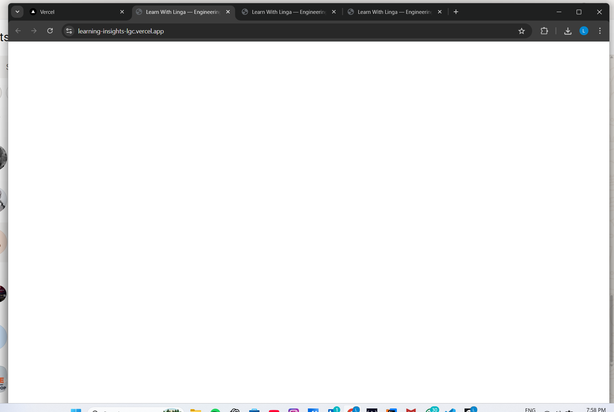
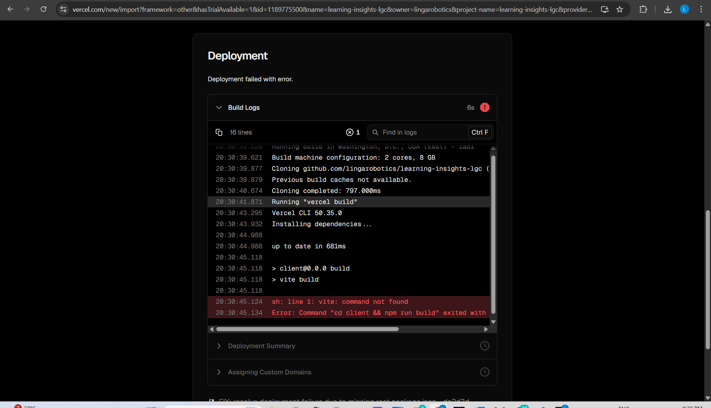
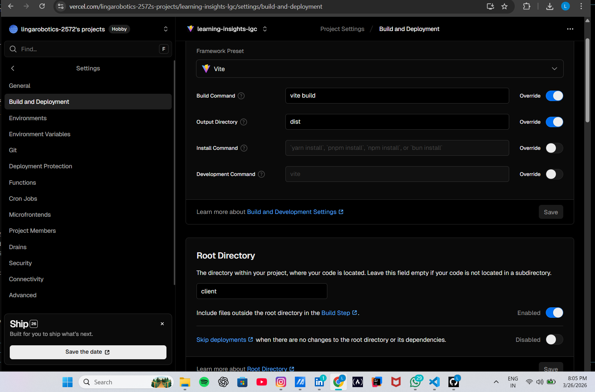
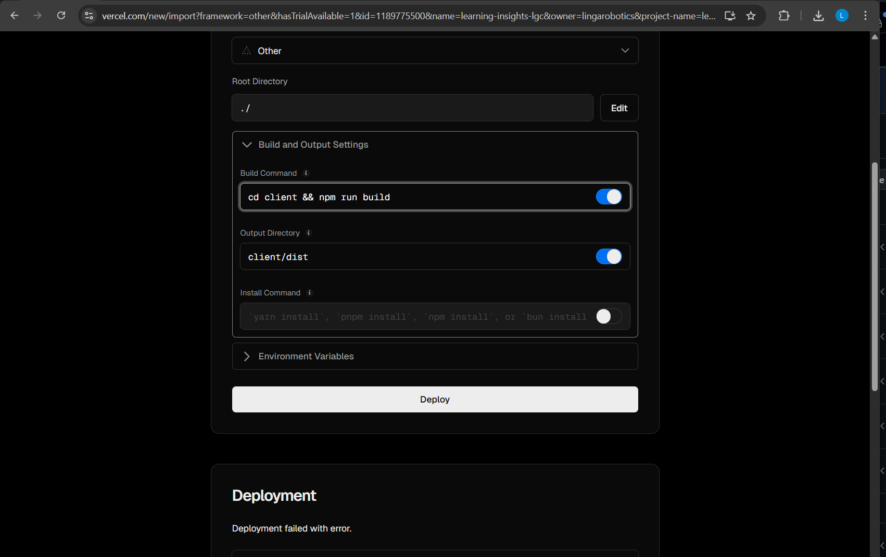
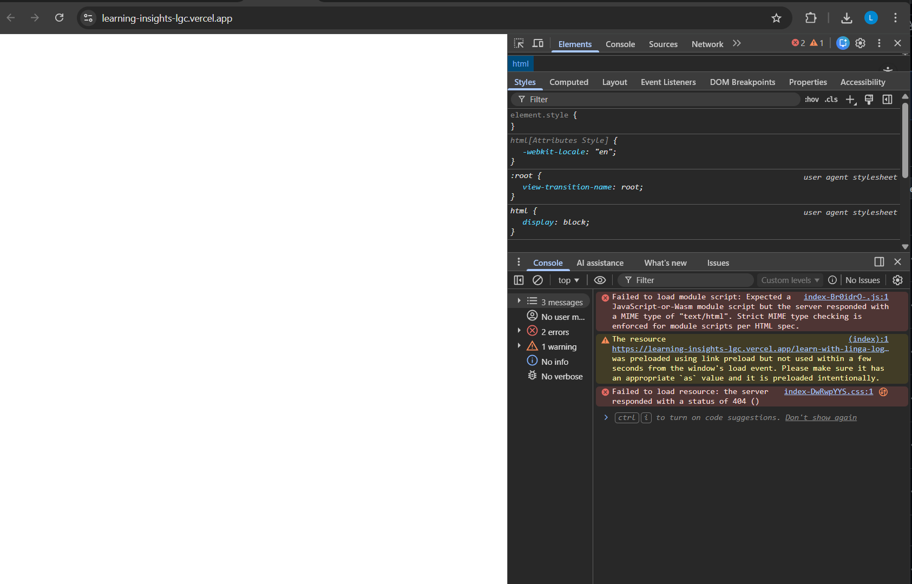

# Deployment — Build and Hosting (Vercel)

---

## 1. Overview

The Learn With Linga system is deployed using:

- Vercel (hosting + serverless functions)
- Vite (frontend build)
- Node-based API routes

Deployment is not just pushing code.

It requires a correct build pipeline.

---

## 2. Deployment Architecture

The system uses:

- Root project → controls build  
- Client (React app) → built using Vite  
- API routes → handled by Vercel  

Final output:

client/dist/

This is what gets served in production.

---

## 3. Build Pipeline

Correct build flow:

1. Navigate to client  
2. Install dependencies  
3. Run build  
4. Output to dist  

Final command used:

cd client && npm install && npm run build

This ensures:
- dependencies exist  
- build tools (vite) are available  
- output is generated correctly  

---

## 4. Failure — Blank UI after deployment

### What happened

- Page loaded
- No UI rendered

### Root cause

JavaScript bundle was not loaded.

Browser showed:
- Failed to load module script  
- MIME type issue  

### Fix

Ensured:
- correct build output  
- correct static serving  

---

## 5. Failure — Build failed (vite not found)

### Error

vite: command not found

### Root cause

Dependencies were not installed before build.

---

## 6. Failure — Incorrect build command

### Mistake

Used:

npm run build

without installing dependencies.

### Result

Build failed.

---

## 7. Failure — Missing install step

### Fix

Updated root `package.json`:

"scripts": {
"build": "cd client && npm install && npm run build"
}

### Result

- Dependencies installed  
- Build succeeded  
- Deployment worked  

---

## 8. Debugging using DevTools

### What I did

Opened browser DevTools.

### What I saw

- Module loading error  
- Script not recognized  

### Insight

Deployment issues must be debugged using:
- build logs  
- browser logs  

Not assumptions.

---

## 9. Key Deployment Rules

### Rule 1 — Always install dependencies

Build without dependencies will fail.

---

### Rule 2 — Never assume platform behavior

Platforms like Vercel do not always:
- install automatically  
- configure correctly  

Explicit steps are required.

---

### Rule 3 — Check logs first

Always check:

- Vercel build logs  
- Browser DevTools  

---

### Rule 4 — Validate output directory

Ensure:

client/dist/

is correctly generated and served.

---

## 10. Final Deployment State

After fixes:

- Build pipeline works  
- API routes function correctly  
- Static files load correctly  
- UI renders properly  

---

## 11. Summary

Deployment failures were caused by:

- missing dependency installation  
- incorrect build commands  
- wrong assumptions about platform behavior  

Fixing required:

- understanding build pipeline  
- reading logs carefully  
- validating output  

---

## 12. Final Understanding

Deployment is not just code execution.

It is:

- environment setup  
- dependency management  
- build correctness  
- output validation  

If any step is incorrect:

The system will fail — even if code is correct