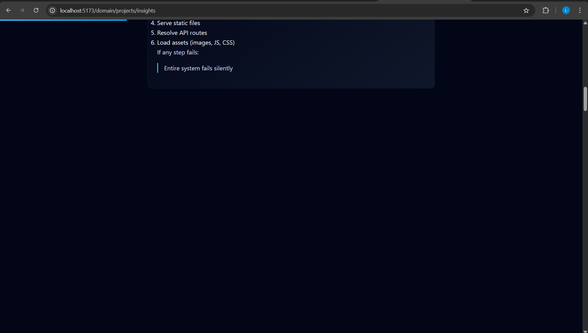
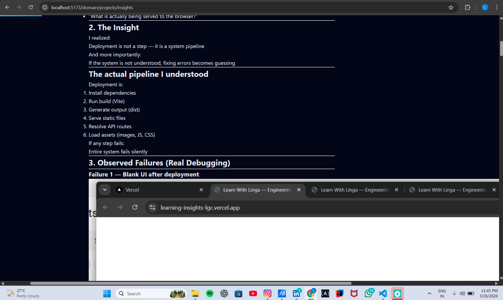

# Rendering — Markdown to UI Pipeline

---

## 1. Overview

The Learn With Linga system is built on a markdown-driven rendering model.

Content is written in markdown and dynamically converted into UI.

Rendering is handled by:

- React (UI layer)  
- ReactMarkdown (parser)  
- CSS (layout and control)  

---

## 2. Rendering Pipeline

The full flow:

1. Markdown file is created  
2. API reads file as text  
3. Content sent as JSON  
4. Frontend receives content  
5. ReactMarkdown parses markdown  
6. UI is rendered  
7. CSS controls final appearance  

---

## 3. Markdown Rendering

Rendering uses:

ReactMarkdown

Key behavior:

- Converts markdown → HTML elements  
- Preserves structure  
- Supports headings, lists, images  

---

## 4. Section-Based Rendering

To enable animated UI, content is split into sections.

Method used:

split(/(?=\n## )/)

This ensures:

- each `##` becomes a separate section  
- structure is preserved  
- markdown is not broken  

Each section is rendered as a card.

---

## 5. UI Layout Model

Each section becomes:

- a card container  
- alternating left/right layout  
- animated on scroll  

This creates:

- visual separation  
- readable structure  
- controlled flow  

---

## 6. Image Rendering System

### Storage

Images are stored in:

client/public/images/

---

### Markdown Reference

Images are used like:

/images/...

---

### Rendering Behavior

Images are:

- rendered inside section cards  
- resized using CSS  
- clickable for zoom  

---

## 7. Failure — Image not visible

### What happened

- Image existed  
- Click worked (zoom opened)  
- But image not visible  

### Root cause

CSS caused visual suppression:

- blur applied  
- opacity reduced  
- layout constraints  

### Fix

Adjusted CSS:

- removed excessive blur  
- increased visibility  
- ensured proper sizing  

---

## 8. Failure — Image too large

### Problem

- Image filled entire card  
- Broke layout  

### Cause

No controlled width.

### Fix

Implemented:

- fixed preview size  
- responsive scaling  
- zoom for full view  

---

## 9. Final Image Strategy

Images now follow:

- small preview inside card  
- edge-aligned layout (desktop)  
- clean layout (mobile)  
- click to zoom  

---

## 10. CSS Control Layer

Rendering is not fully controlled by markdown.

CSS defines:

- spacing  
- alignment  
- image size  
- responsiveness  

This separation ensures:

- markdown stays simple  
- UI stays consistent  

---

## 11. Mobile Rendering Fix

Problem:

- images overflowed  
- blur reduced clarity  

Fix:

- width set to 100%  
- blur removed  
- spacing adjusted  

Result:

- clean mobile view  
- readable content  

---

## 12. Divider Issue (---)

Markdown:

Rendered as `
`.

### Problem

- unwanted separators  
- broke visual flow  

### Fix

CSS rule applied:

- hide `
`  

---

## 13. Key Rendering Rules

### Rule 1 — Do not break markdown structure

Avoid unsafe parsing.

---

### Rule 2 — Keep rendering logic separate

- markdown → structure  
- CSS → appearance  

---

### Rule 3 — Always test in browser

Rendering issues are visual.

Use:
- DevTools  
- real device testing  

---

### Rule 4 — Control images via CSS

Do not rely on markdown for layout.

---

## 14. Final Understanding

Rendering is not just parsing markdown.

It is:

- structuring content  
- controlling layout  
- managing responsiveness  
- ensuring readability  

If any layer fails:

Content may exist — but not be visible or usable